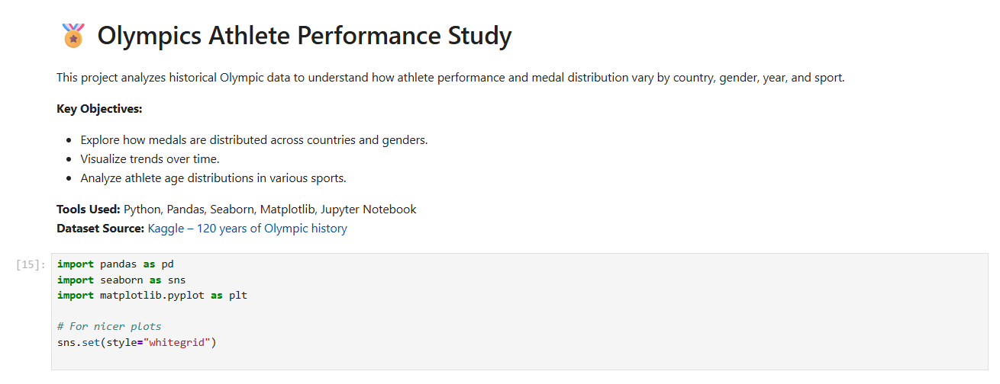
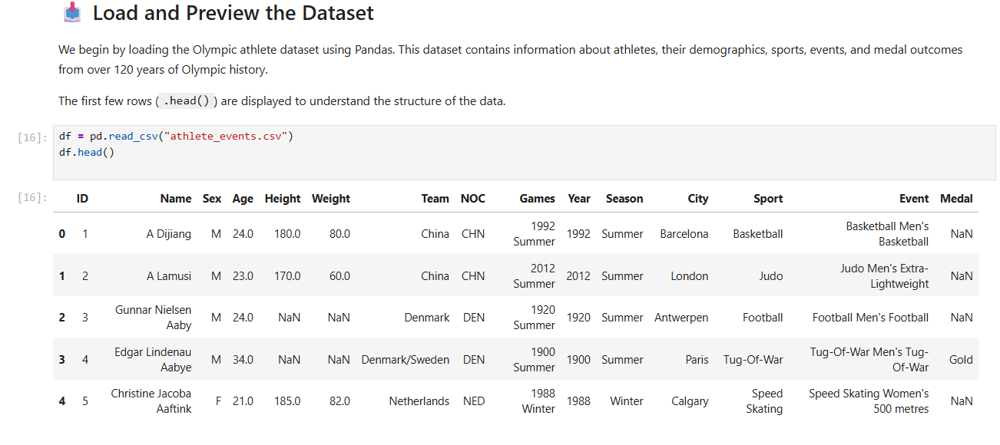
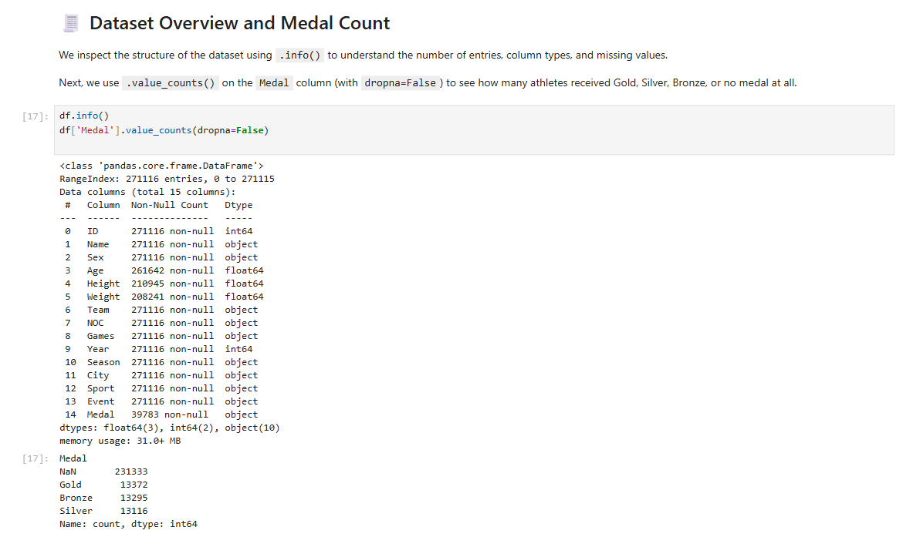
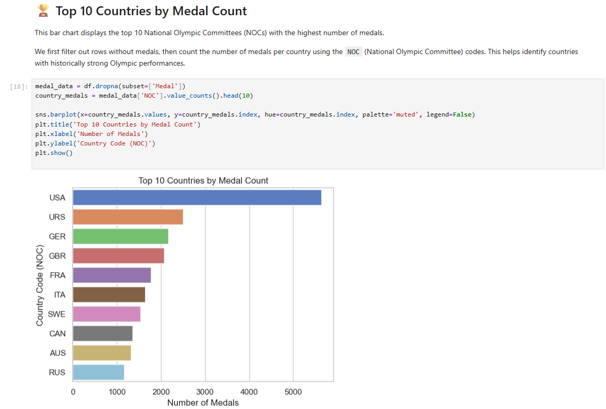
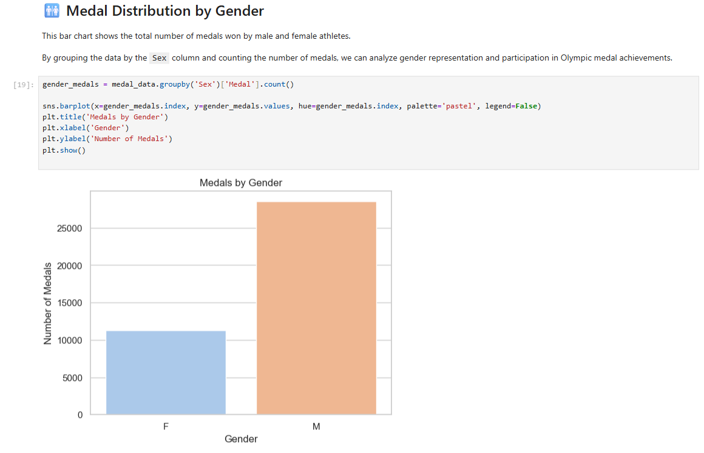
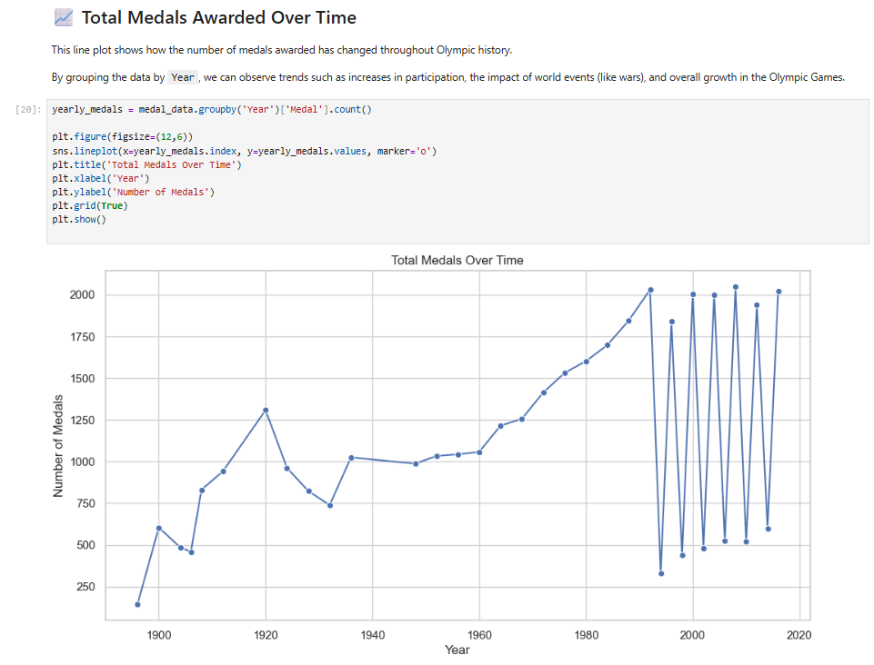
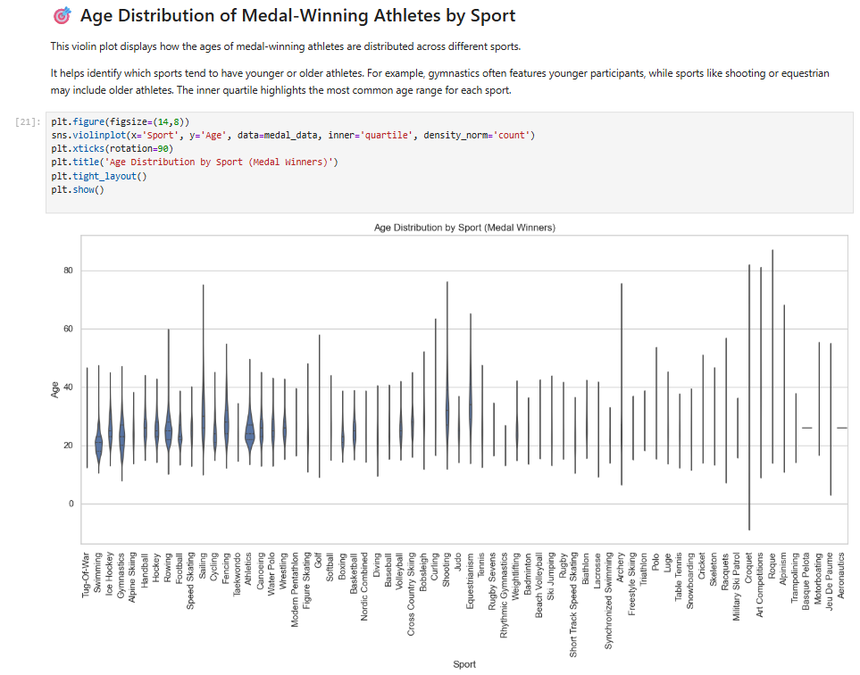

#  Olympics Athlete Performance Study

This project analyzes over 120 years of Olympic history to explore trends in medal distribution by country, gender, sport, and year.

##  Project Files
- `Olympics_Athlete_Performance_Study.ipynb` — Main notebook with analysis and visualizations
- `athlete_events.csv` — Dataset from Kaggle
- `requirements.txt` — Python dependencies

##  Visualizations
- Top 10 countries by medal count (bar chart)
- Gender-wise medal distribution (bar chart)
- Total medals over the years (line chart)
- Age distribution by sport (violin plot)

##  Tools Used
- Python
- Pandas
- Seaborn
- Matplotlib
- Jupyter Notebook

##  Project Previews

Screenshots from the Jupyter Notebook:

  
  
  
  
  
  
  

##  Key Insights
-  **USA** has historically won the most medals.
-  **Female participation** has increased over time.
-  **Gymnastics** features younger athletes; 🧓 **Shooting** attracts older ones.
-  Total number of medals awarded has grown consistently with Olympic expansion.

---

>  Created by **Pratiksha Shingare**
